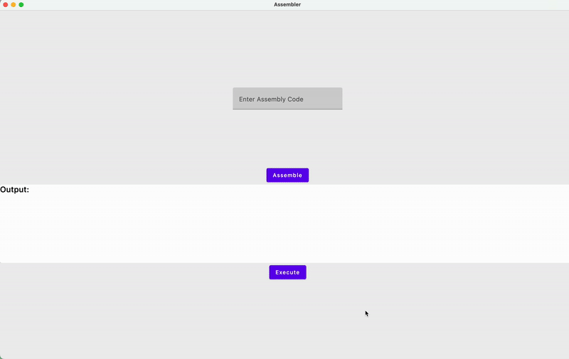
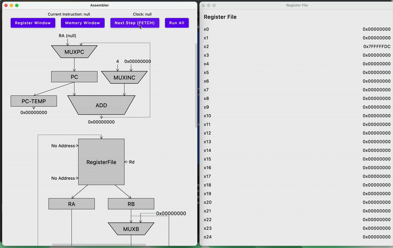
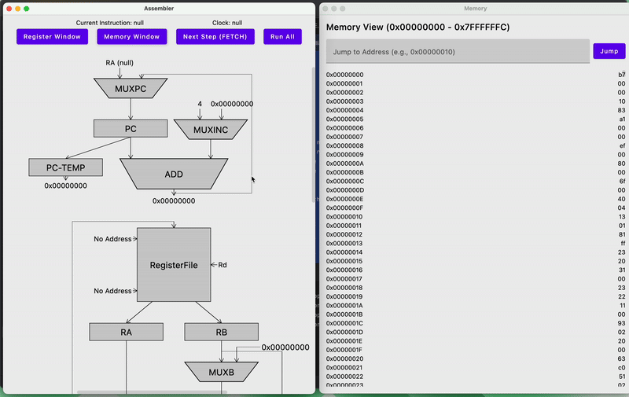
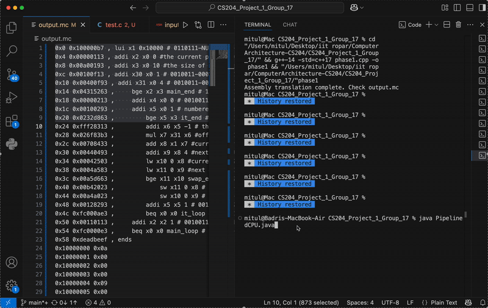

# RISC-V Simulator – CS204 Project

This repository implements a 3-phase RISC-V 32-bit simulator as part of the CS204 Computer Architecture course. Each phase builds upon the previous one, simulating the RISC-V ISA from assembly to pipelined execution.

---

## Phase 1 – RISC-V Assembler (CS204 Project)

This component implements a **RISC-V Assembler** that translates 32-bit RISC-V assembly code into machine code (`.mc` format), mimicking the behavior of tools like the Venus Assembler.

---

##  Features

-  Supports 31 RISC-V base instructions across **R**, **I**, **S**, **SB**, **U**, and **UJ** formats.
-  Handles assembler directives:
    - `.text`, `.data`
    - `.byte`, `.half`, `.word`, `.dword`, `.asciz`
-  Parses label references and generates PC-relative offsets for branches and jumps.
-  Supports immediate values in:
    - Decimal (e.g., `10`)
    - Hexadecimal (e.g., `0x1A`)
    - Binary (e.g., `0b1010`)
-  Automatically formats output similar to Venus `.mc` format:
    - **Instruction address**, **machine code**, **original instruction**, and **field breakdown**

---

##  Input

- **Assembly File** (via `stdin` or redirected file)
- Should contain a `.text` segment for code and optionally a `.data` segment for memory content.

###  Sample `input.asm`:
```asm
.text
main: add x1, x2, x3
      sub x4, x5, x6
.data
val: .word 5 10
```

###  Output:
- `output.mc` – Machine code + address + commentary

---

##  RISC-V Simulator –  (Kotlin GUI Version)

**Goal**: Implement 5-stage instruction execution on .mc files.

###  Features:
- Simulates core 32-bit RISC-V base instructions
- Tracks and logs:
- Program Counter (PC)
- Register File (x0–x31)
- Memory Accesses
- Clock Cycles
- Instruction-by-instruction GUI visualization
- Terminal logging of each instruction cycle
### Technology Stack
- Kotlin Multiplatform
- Jetpack Compose for Desktop
- Gradle Kotlin DSL
- State management via ViewModel
- Composable UI components
###  Input:
- `.mc` file generated by Phase 1

###  Output (GUI):




---

## ️ Phase 3: Pipelined Simulator

**Goal**: Simulate pipelined RISC-V execution with inter-stage registers, hazards, and branch prediction.

###  Features:
- 5-stage pipeline with inter-stage buffers
- **Knobs** to enable/disable:
    - Pipelining
    - Data forwarding
    - Register file print
    - Pipeline tracing
    - Branch predictor output
- Implements:
    - **Data hazards** (with stalling or forwarding)
    - **Control hazards** (with branch prediction and flushing)
    - Separate **text and data memory**
- Outputs detailed **pipeline stats** and **performance metrics**

###  Output Stats:
- Total cycles, Instructions executed, CPI
-  ALU / Load-Store / Control instructions
-  Hazards, # Stalls, # Mispredictions


##  Test Cases

Tested with:
- Fibonacci
- Factorial
- Bubble Sort  
  (*All in `.asm` and corresponding `.mc` format*)

---


